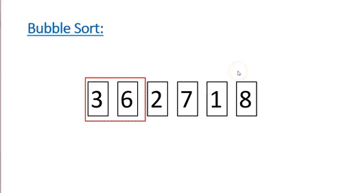

# Bubble Sort

This is little advanced than Selection sort. 
In this method we compare every two consecutive numbers int the collection, 
and swap the positions if req. 

A bubble seems to travel accross the collection in a loop.

Time complecity : (Best = 0(n2)) (Average = 0(n2)) (Worst = 0(n2))

