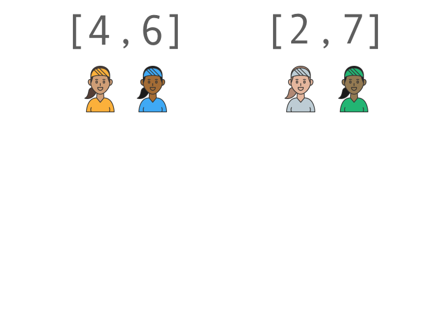

# Merge Sort

Recursively break the collection upto single element.
Merge them back by sorted merging.

# Merging two sorted collections
Create new collection of combined size.
Run pointers on both the sorted collections.
Compare each element from both the collection and add the smaller one first to the new collection.

* Divide and concure technique.

* Best time complexity in all cases

* It has high memory footprint as merging of two collection and creating new collection req additional memory

* Good for external sorting (Cases were we have to merge sorted collections)(Ex: Sorting of a large file)

Time complecity : (Best = 0(log-n)) (Average = 0(log-n)) (Worst = 0(log-n))

#Merging two sorted collections

#Merge Sorting

