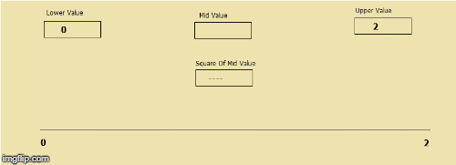

# Algorithms
# Square Root Problem

	To Find Square root of a given number
	Square root of perfect square would be integer : Root of 4 = 2
 	Square root of imperfect square would be fractional number : Root of 2 = 1.414
 	Square root of negative  number would be imaginary number with iota : Root of -4 = 2i

Input :  
 > N = 2; Number for which square root is to be determined.

Output :  
 >  1.414 ;Square Root of Given Number.

# Solution 

